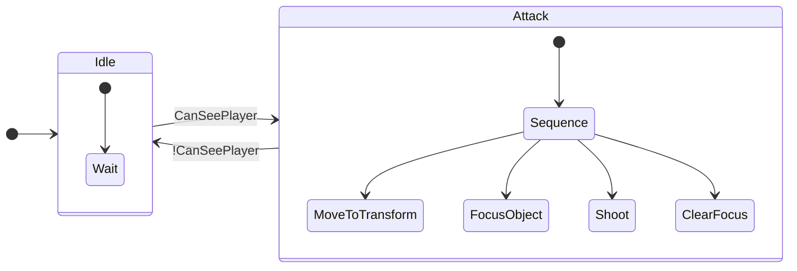
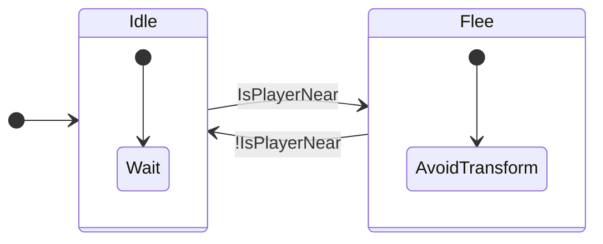
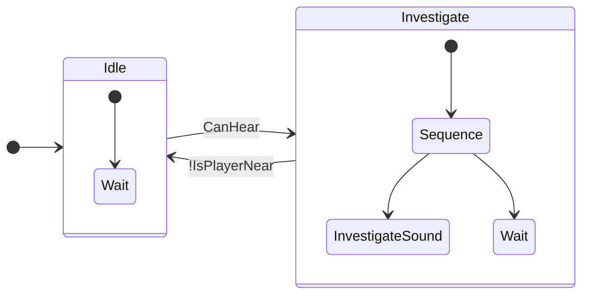
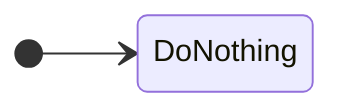

# State Machine Diagrams
---

## SimpleAIController
> *"simple"*

## ShyAIController

## CuriousAIController

## NoAIController

> [!NOTE]
> There's also `TestController`, but it inherits from NoAIController anyway